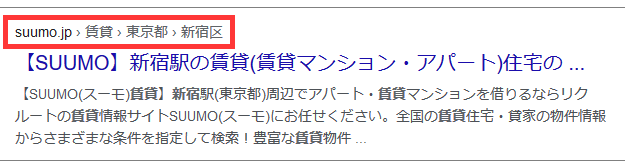

# HTTP/2時代の新しいユースケース

本章ではブラウザとサーバー間での通信ではなく検索エンジンやソーシャルメディアが理解するプロトコルを中心に紹介します。

## レスポンシブデザイン

小さなスクリーンのユーザーに適したレイアウト、あるいはタブレット端末の横断方向それぞれに最適なレイアウトなど、ユースケースごとに適切な表現を可能にするのが**レスポンシブデザイン**端末ごとに、画面の解像度は違う。しかしそれぞれの端末にあった解像度に合わせた共通解像度として**論理解像度(論理上のスクリーンサイズ)** がある。これを**CSSピクセル**という。

```
モバイルシミュレーションモードでのCSSピクセル
> window.innerWidth
412
> window.innerHeight
737
> window.devicePixelRatio
3.5
```

CSSピクセルは幅412ピクセルで、高さが732ピクセルある。ピクセルデバイスレシオは3.5。乗算すると$2562\times 1442$ピクセルで実際の物理解像度の$2560\times1440$と一致する。
デフォルトのモバイル向けブラウザは、PC専用に作られたサイトも、モバイル向けのサイトもなるべくユーザーに負担なく見せようとレンダリングしながら適切なスクリーンの拡大縮小比率を決定しようと頑張る。

```
<meta name="viewport" content="width=device-width", initial-scale=1.0">
```

画面サイズはOKだが、幅400ピクセルの画像が表示されるとジャギーが目立ってしまう。
srcset属性を使って複数の画像ソースを指定して、ブラウザが適切なファイルを選択できる。

```

```

srcset属性はピクセルデバイスレシオ以外にも、実際の表示サイズをもとにした洗濯など様々な機能を備えている。スタイルシートでも***image-set()*** 関数を利用して同じことができる。
レスポンシブデザインはモバイル/デスクトップの切り替え以外にも、画面を横にしたときや、アイコンをクリックしたときなどにも柔軟に対応できる。

### 対応する画像ファイルの増加

近年はブラウザの対応も進んだことから新しい画像ファイルも活用できる土台が整った。
うまくファイルフォーマットを選択するだけで大きなパフォーマンスのインパクトが期待できる。
|ファイルの種類|色数|可逆|アルファチャネル|アニメーション|HDR対応|
|:-|:-|:-|:-|:-|:-|
|JPEG|フルカラー|||||
|PNG|フルカラー|✓|✓|APNGあり||
|GIF|256色||1ビットのみ|||
|WebP|フルカラー|可逆・非可逆両方対応|✓|✓||
|AVIF|フルカラー||✓|✓|✓|
|HEIF(Safariのみ)|フルカラー||✓|✓|✓|

## セマンティックウェブ

セマンティックウェブはウェブで表面的な「テキスト」「文章」ではなく、「意味」を扱えるようにして、ウェブの可能性を広げようという運動のこと。
現在のセマンティックウェブが目指す世界は２つの別の方法で実現された。

1. XMLやJSONによる表現
   1. 用途ごとのボキャブラリー(意味？？)を解釈？？
   2. [schema.org](schema.org)803種類の型が登録されている
   3. マイクロデータやJSON-LDからも参照される
2. ChatGPT
   1. データ量があれば意味を人間が正規化しなくても使える
   2. 大量のデータから意味を理解して応答する

### マイクロデータ

マイクロデータはWHATWG、W3Cなどで議論がされてきたHTMLに埋め込み可能なセマンティック表現方法。
マイクロデータはボキャブラリーのコレクションを持っており、現在でも検索エンジンがサポートしている。

```
マイクロデータのサンプル(schema.orgのサンプル)
<div itemscope itemtype="http://schema.org/Person">
    <span itemprop="name">ジョージ・ブッシュ</span>
    <span itemprop="disambiguatingDescription">第41代アメリカ大統領</span>
    は
    <div itemprop="children" itemscope itemtype="http://schema.org/Person">
        <span itemprop="name">ジョージ・W・ブッシュ</span>
        <span itemprop="disambiguatingDescription">第43代アメリカ大統領</span>
    </div>
    の父です
</div>
```

- disambiguationDescription
  - description のサブプロパティ。他の類似項目との曖昧性解消に使用される項目の短い説明。記述が曖昧性解消に役立つためには、他のプロパティ（特に名前）からの情報が必要な場合がある。

既存のHTMLの属性と衝突しないように使う属性は

- itemscope
- itemtype
- itemprop
の3種類を使って表現。
schema.orgの前身は以下をサポートしており、今の検索エンジンでも利用できるらしい
- Event
- Organization
- Person
- Product
- Review
- Review-aggregate
- Brenderumb
- Offer
- Offer-aggregate

### JSON-LD

schema.orgはサンプルデータとしてマイクロデータ、JSON-LD、RDFaの3種類を掲載している。
今はGoogleはJSON-LDの使用を推奨している。
JSON-LDはHTMLではないため本文中に埋め込むことはできないが、scriptタグを使ってHTMLに記述する方法がW3Cの仕様書に書かれている。既存のコンテンツに影響なく埋め込むことができるのがでけえ。
検索エンジンはこのタグを含むページを読み込むときに、ページに付随するメタデータとして特別扱いする。

```
JSON-LDの例
<script type="application/ld+json">
    {
        "@context": "http://schema.org",
        "@type": "Organization",
        "url": "http://www.your-company-site.com",
        "contactPoint": [{
            "@type": "ContactPoint",
            "telephone": "+1-401-555-1212",
            "contactType": "customer service"
        }]
    }
</script>
```

SEO対策になるらしい。
対応しているデータフォーマット

- パンくずリスト
  - 
- ウェブサイト情報
  - サイト名
  - 企業の問い合わせ窓口
  - ロゴ
  - ソーシャルメディア情報
- 創作物
  - 記事
  - 書籍
  - 教育コース
  - 音楽
  - レシピ
  - レビュー
  - テレビ番組、映画
  - ビデオ
- 商業
  - ローカルビジネス
  - イベント
  - 商品
- 科学
  - 科学データセット

### RSS

セマンティックウェブの初期の取り組みではRDF(Resource Description Framework)と呼ばれるXML形式で記述する意味グラフ構造をもとに意味のデータベースを作ろうとしていた。あんま成功しなかった。
RDFの応用例として一番成功したのがRSS(RDF Site Summary)。一時期多くの人が使っていた。
ブログやウェブサイトを更新するとブログエンジンやコンテンツ管理システムが自動的に更新。
RSSファイルには新しい順に新規コンテンツの概略が格納される。
専用のリーダーがR登録したRSSの更新チェックを行い未読のエントリーを集めて効率的に閲覧できるようにする。[rdfの例](http://blog.shibu.jp/index.rdf)

### RDF系以外のデータ

#### vCard

RFC 2425とRFC 2426で定義され、RFC 6350で統合された連絡先の交換フォーマット。
MIMEタイプはtext/vcard。HTTPを使って配信もでき、vcfの拡張子を持つファイルとして扱える。
QRコードに載せてスマートフォンに直接読み込ませることも可能。
vCardはテキストフォーマット。BEGIN:VCARDとEND:VCARDで挟まれたテキストブロックの中に1行で1項目のプロパティが並ぶ。

```
vCardのサンプル
BEGIN:VCARD
VERSION:3.0
ADR:;;四谷坂町１２－２２;新宿区;東京都;160-0002;日本
N:渋川;よしき;;;
TEL:(+81) 3-3356-5227
END:VCARD
```

#### iCalendar
RFC 2445で定義されRFC 5545で最新版が公開。スケジュールやカレンダー、TODOの交換用フォーマット。
MIMEタイプはtext/calendar。HTTPでの配信や.ics拡張子のファイルとしても使える。QRコードに載せてスマートフォンに直接読み込ませることも可能。
BEGIN:VCALENDARとEND:VCALENDARの中に、BEGIN:VEVENTとEND:VEVENTなどの構成要素が含まれた複合フォーマット。
```
iCalendarのサンプル
BEGIN:VCALENDAR
VERSION:2.0
BEGIN:VEVENT
CREATED:20190712T010442Z
LAST-MODIFIED:20190712T010442Z
DTSTART:20190712T000000Z
DTEND:20190712T010000Z
SUMMARY:Goconference'19 summer in Fukuoka
DESCRIPTION: Go and Enjoy Fukuoka!
LOCATION:Fukuoka Growth Next
URL:https://fukuoka.gocon.jp/jp/
END:VEVENT
END:VCALENDAR
```
コンテンツを返すサーバーがあるとき、そのURLをGoogleカレンダーに登録することで自動登録、更新ができる。
## オープングラフプロトコル
ソーシャルネットワークで使われるメタデータ。オープングラフプロトコルが設定されているウェブサイトのURLをSNSに張り付けると記事の一部が引用され画像も表示される。SNS以外にも普通のウェブサイトでもオープングラフプロトコルに対応している。xmlns:og="http://ogp.me/ns#"で名前空間を定義。
```
オープングラフプロトコルの例
<html xmlns:og="http://ogp.me/ns#">
```
SNS向けのメタタグ
- og:title
  - タイトル
- og:type
  - 種類
- og:url
  - URL
- og:image
  - 画像
- og:description
  - 引用ページに張り付けるテキスト

og:description以外は必須。
ほかにも
- og:audio
  - 音声ファイル
- og:determiner
  - a, theなどの冠詞
- og:locale
  - ページのコンテンツが対象としている言語
- og:locale:alternate
  - このページが提供するほかの言語
- og:site_name
  - サイト名
- og:video
  - 動画ファイル
[オープングラフプロトコルの公式ページ](https://ogp.me/)により細かく書いてある。

## QRコード

- デンソーウェーブが1994年に開発。
- 数値は7000桁以上まで対応、印刷面積が小さい。高密度。
- 読み出しが高速。
- 多少の欠損があっても復元可能
- 数字最大限詰め込むモード
- 日本語詰め込むモード(1800文字)
- 英字記号モード(4296文字)
  - 英語の小文字が使えない
  - 空白、$、%、*、+、-、.、/、:、 使える
  - ?、&、#、使えない
- バイナリモード
  - 一般的
  - 2953バイト
  - 誤り訂正レベル4段階
  - レベル4だと1273バイト

### QRコードとスキーム

Googleが提供しているQRコードの作成、読み取りライブラリ[ZXing](https://github.com/zxing/zxing)デファクトスタンダード。
いろいろなデータに対応している。

- URL
- メールアドレス
- 電話、SMS、MMS、FaceTime
- Wi-Fiネットワーク設定
- vCardとiCalendar
- TOTPの秘密鍵
  - 鍵管理アプリケーションに秘密鍵が登録される

## モバイルアプリケーションにより多様化するブラウズ環境
 
